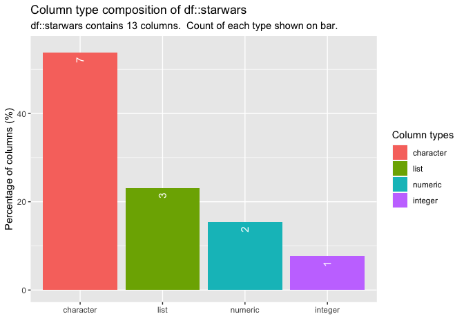
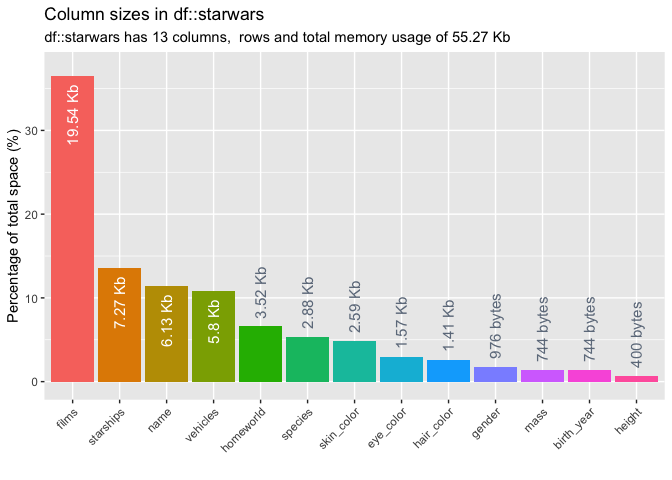
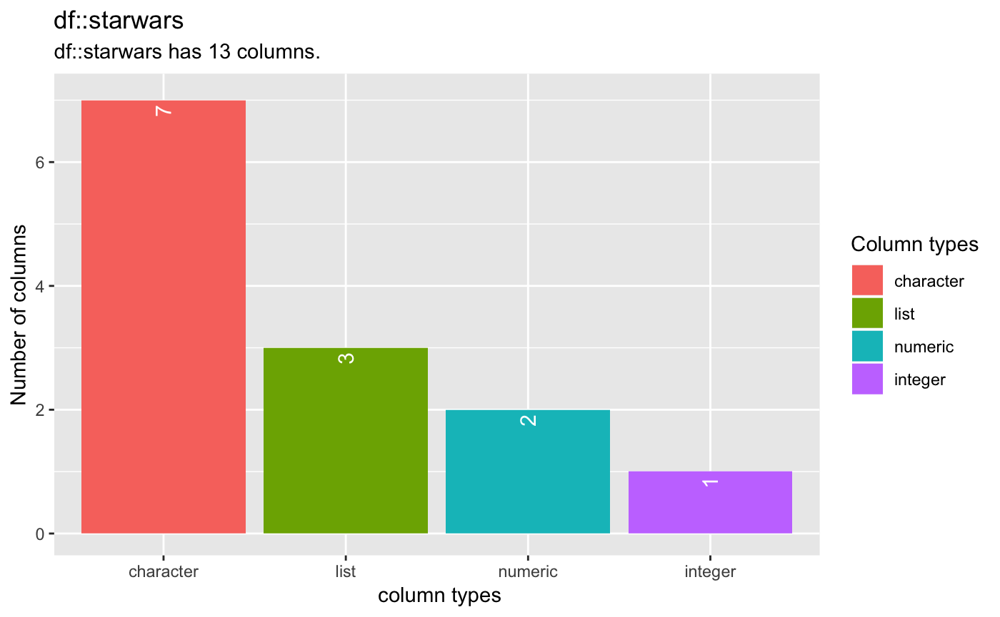
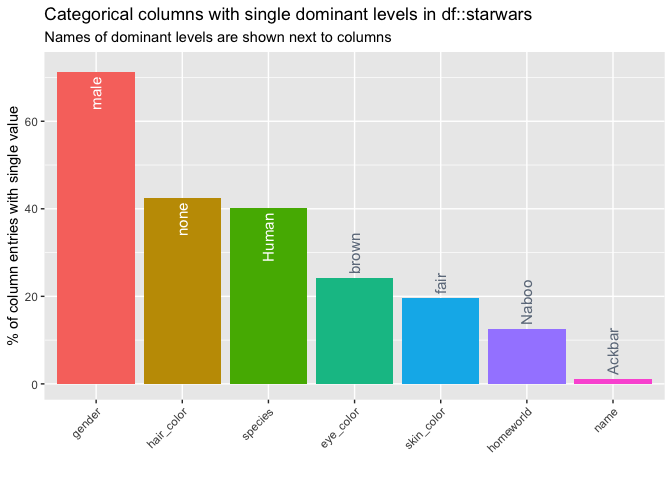
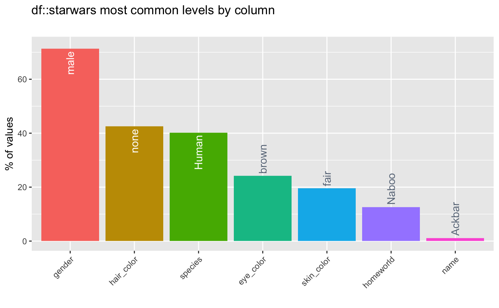

reporter 
====================================================================

[](https://travis-ci.org/alastairrushworth/reporter) [](https://codecov.io/gh/alastairrushworth/reporter)

Overview
--------

`reporter` is collection of utilities for columnwise summary, comparison and visualisation of data frames. Functions are provided to report missingness, categorical levels, numeric distribution, correlation, column types and memory usage.

The package has three aims:
+ to speed up repetitive checking and exploratory tasks for data frames
+ to make it easier to compare data frames for differences and inconsistencies
+ to support quick visualisation of data frames

Installation
------------

To install the development version of the package, use the command

``` r
devtools::install_github("alastairrushworth/reporter")
```

Then load the package and the `starwars` data.

``` r
# load reporter
library(reporter)

# some example data
data(starwars, package = "dplyr")
```

Single data frame summaries
---------------------------

#### Column types

To explore the column types in a data frame, use the function `report_types`. The command returns a tibble summarising the percentage of columns with the a particular type. A barplot is also returned when `show_plot = TRUE`.

``` r
# return tibble and visualisation of columns types
report_types(starwars, show_plot = T)
```



    ## # A tibble: 4 x 4
    ##   type        cnt  pcnt col_name 
    ##   <chr>     <int> <dbl> <list>   
    ## 1 character     7 53.8  <chr [7]>
    ## 2 list          3 23.1  <chr [3]>
    ## 3 numeric       2 15.4  <chr [2]>
    ## 4 integer       1  7.69 <chr [1]>

#### Memory usage

To explore the memory usage of the columns in a data frame, use the function `report_mem`. The command returns a tibble containing the memory usage and percentage of total usage for each column in the data frame. A barplot is also returned when `show_plot = TRUE`.

``` r
report_mem(starwars, show_plot = T)
```



    ## # A tibble: 13 x 3
    ##    col_name   size        pcnt
    ##    <chr>      <chr>      <dbl>
    ##  1 films      19.54 Kb  36.5  
    ##  2 starships  7.27 Kb   13.6  
    ##  3 name       6.13 Kb   11.5  
    ##  4 vehicles   5.8 Kb    10.8  
    ##  5 homeworld  3.52 Kb    6.58 
    ##  6 species    2.88 Kb    5.39 
    ##  7 skin_color 2.59 Kb    4.85 
    ##  8 eye_color  1.57 Kb    2.93 
    ##  9 hair_color 1.41 Kb    2.63 
    ## 10 gender     976 bytes  1.78 
    ## 11 mass       744 bytes  1.36 
    ## 12 birth_year 744 bytes  1.36 
    ## 13 height     400 bytes  0.730

#### Missing values

`report_na` is used to report the number and proportion of missing values contained within each column in a data frame. The command returns a tibble containing the count (`cnt_na`) and the overall percentage (`pcnt_na`) of missing values by column in the data frame. A barplot is also returned when `show_plot` is set to `TRUE`.

``` r
report_na(starwars, show_plot = T)
```



    ## # A tibble: 13 x 3
    ##    col_name     cnt  pcnt
    ##    <chr>      <int> <dbl>
    ##  1 birth_year    44 50.6 
    ##  2 mass          28 32.2 
    ##  3 homeworld     10 11.5 
    ##  4 height         6  6.90
    ##  5 hair_color     5  5.75
    ##  6 species        5  5.75
    ##  7 gender         3  3.45
    ##  8 name           0  0   
    ##  9 skin_color     0  0   
    ## 10 eye_color      0  0   
    ## 11 films          0  0   
    ## 12 vehicles       0  0   
    ## 13 starships      0  0

#### Correlation

`report_cor` returns a tibble containing Pearson's correlation coefficient, confidence intervals and *p*-values between pairs of numeric columns in a data frame. The function combines the functionality of `cor()` and `cor.test()` into a more useable wrapper. An point and whiskers plot is also returned when `show_plot = TRUE`.

``` r
report_cor(starwars, show_plot = T)
```


    ## # A tibble: 3 x 6
    ##   col_1      col_2    corr p_value  lower   upper
    ##   <chr>      <chr>   <dbl>   <dbl>  <dbl>   <dbl>
    ## 1 birth_year mass    0.478 0.00318  0.130  0.721 
    ## 2 birth_year height -0.400 0.00789 -0.651 -0.0690
    ## 3 mass       height  0.134 0.312   -0.163  0.409

**Notes**

-   The tibble is sorted in descending order of the absolute coefficient.
-   `report_cor` drops missing values prior to calculation of each correlation coefficient.
-   The `p_value` column is associated with the null hypothesis *H*<sub>0</sub> : *ρ* = 0.

#### Feature imbalance

Categorical features where each element is identical (or nearly) are often removed or scrutinised more closely. The function `report_imbalance` helps to find categorical columns that are dominated by a single feature level and returns a tibble containing the columns: `col_name` the categorical column names; `value` the most frequently occurring categorical level in each column; `percent` the percentage frequency with which the value occurs. The tibble is sorted in descending order of the `percent`. A barplot is also returned when `show_plot` is set to `TRUE`.

``` r
report_imb(starwars, show_plot = T)
```



    ## # A tibble: 7 x 4
    ##   col_name   value   pcnt   cnt
    ##   <chr>      <chr>  <dbl> <int>
    ## 1 gender     male   71.3     19
    ## 2 hair_color none   42.5      1
    ## 3 species    Human  40.2      1
    ## 4 eye_color  brown  24.1     10
    ## 5 skin_color fair   19.5      2
    ## 6 homeworld  Naboo  12.6      3
    ## 7 name       Ackbar  1.15     1

#### Numeric summaries

`report_num` generates statistical summaries of numeric columns contained in a data frame, combining some of the functionality of `summary` and `hist`. The tibble returned contains standard numerical summaries (min, max, mean, median etc.), but also the percentage of missing entries (`percent_na`) and a simple histogram (`hist`). If `show_plot = TRUE` a histogram is generated for each numeric feature.

``` r
report_num(starwars, show_plot = T, breaks = 10)
```


    ## # A tibble: 3 x 10
    ##   col_name     min    q1 median  mean    q3   max    sd pcnt_na hist       
    ##   <chr>      <dbl> <dbl>  <dbl> <dbl> <dbl> <dbl> <dbl>   <dbl> <list>     
    ## 1 birth_year     8  35       52  87.6  72     896 155.    50.6  <tibble [1…
    ## 2 height        66 167      180 174.  191     264  34.8    6.90 <tibble [1…
    ## 3 mass          15  55.6     79  97.3  84.5  1358 169.    32.2  <tibble [1…

The `hist` column is a list whose elements are tibbles each containing a simple histogram with the relative frequency of counts for each feature. These tibbles are used to generate the histograms shown when `show_plot = TRUE`. For example, the histogram for `starwars$birth_year` is

``` r
report_num(starwars)$hist$birth_year
```

    ## # A tibble: 20 x 2
    ##    value        prop
    ##    <chr>       <dbl>
    ##  1 [-Inf, 0)  0     
    ##  2 [0, 50)    0.488 
    ##  3 [50, 100)  0.395 
    ##  4 [100, 150) 0.0465
    ##  5 [150, 200) 0     
    ##  6 [200, 250) 0.0233
    ##  7 [250, 300) 0     
    ##  8 [300, 350) 0     
    ##  9 [350, 400) 0     
    ## 10 [400, 450) 0     
    ## 11 [450, 500) 0     
    ## 12 [500, 550) 0     
    ## 13 [550, 600) 0     
    ## 14 [600, 650) 0.0233
    ## 15 [650, 700) 0     
    ## 16 [700, 750) 0     
    ## 17 [750, 800) 0     
    ## 18 [800, 850) 0     
    ## 19 [850, 900) 0.0233
    ## 20 [900, Inf) 0

#### Categorical levels

`report_cat` returns a tibble summarising categorical features in the data frame. This combines the functionality of `report_imbalance` and the `table` function. If `show_plot = TRUE` a barplot is generated showing the relative split. The tibble generated contains the columns

-   `col_name` name of the column
-   `cnt` the number of unique levels in the feature
-   `common` the most common level (see also `report_imb`)
-   `common_pcnt` the percentage occurrence of the most dominant level
-   `levels` a list of tibbles each containing frequency tabulations of all levels.

``` r
report_cat(starwars, show_plot = T)
```


    ## # A tibble: 7 x 5
    ##   col_name     cnt common common_pcnt levels           
    ##   <chr>      <int> <chr>        <dbl> <list>           
    ## 1 eye_color     15 brown        24.1  <tibble [15 × 2]>
    ## 2 gender         5 male         71.3  <tibble [5 × 2]> 
    ## 3 hair_color    13 none         42.5  <tibble [13 × 2]>
    ## 4 homeworld     49 Naboo        12.6  <tibble [49 × 2]>
    ## 5 name          87 Ackbar        1.15 <tibble [87 × 2]>
    ## 6 skin_color    31 fair         19.5  <tibble [31 × 2]>
    ## 7 species       38 Human        40.2  <tibble [38 × 2]>

For example, the levels for the `hair_color` column are

``` r
report_cat(starwars)$levels$hair_color
```

    ## # A tibble: 13 x 2
    ##    value           prop
    ##    <chr>          <dbl>
    ##  1 none          0.425 
    ##  2 brown         0.207 
    ##  3 black         0.149 
    ##  4 <NA>          0.0575
    ##  5 white         0.0460
    ##  6 blond         0.0345
    ##  7 auburn        0.0115
    ##  8 auburn, grey  0.0115
    ##  9 auburn, white 0.0115
    ## 10 blonde        0.0115
    ## 11 brown, grey   0.0115
    ## 12 grey          0.0115
    ## 13 unknown       0.0115

Note that by default, if `NA` values are present, they are counted as a distinct categorical level.

Comparing data frames
---------------------

In addition to printing summaries for a single data frame, each `report_` function can accept two dataframe objects and produces statistics and plots comparing the two dataframes.

#### Example

To keep things simple, suppose we take the `starwars` data and produce two new dataframes `star_1` and `star_2` that randomly sample the rows of the original and drop a couple of columns.

``` r
library(dplyr)
star_1 <- starwars %>% sample_n(50)
star_2 <- starwars %>% sample_n(50) %>% select(-1, -2)
```

#### Comparing column types

When a second dataframe is provided, `report_types` will create a dataframe comparing the count and percentage of each column type. To enable an easy comparison, the dataframe names are embedded into the column names.

``` r
report_types(star_1, star_2, show_plot = T)
```



    ## # A tibble: 4 x 5
    ##   type      cnt_1 pcnt_1 cnt_2 pcnt_2
    ##   <chr>     <int>  <dbl> <dbl>  <dbl>
    ## 1 character     7  53.8      6   54.5
    ## 2 list          3  23.1      3   27.3
    ## 3 numeric       2  15.4      2   18.2
    ## 4 integer       1   7.69     0    0

-   Comparison of column types between the two data frames
