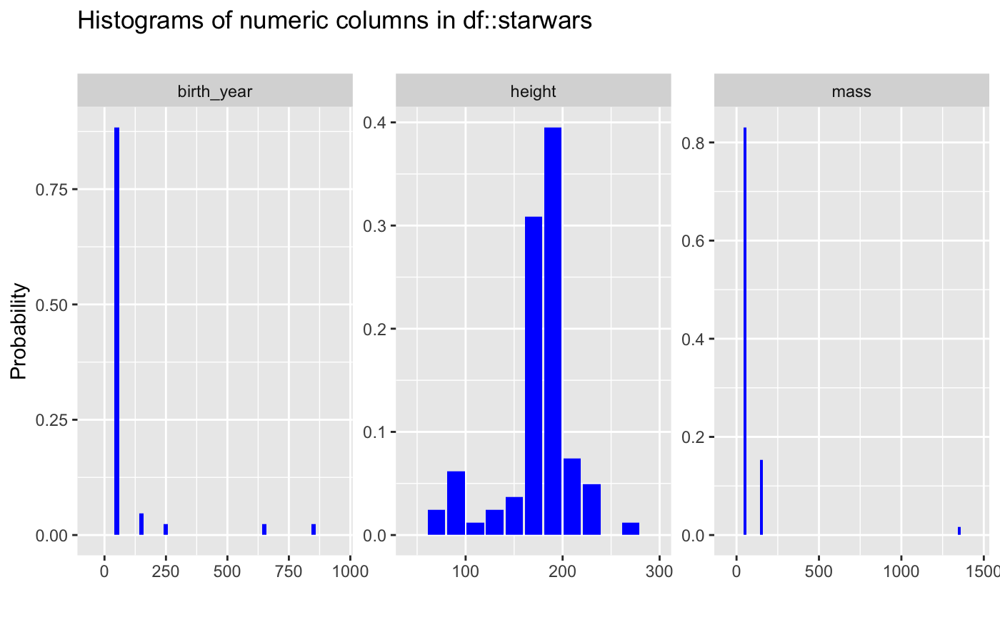
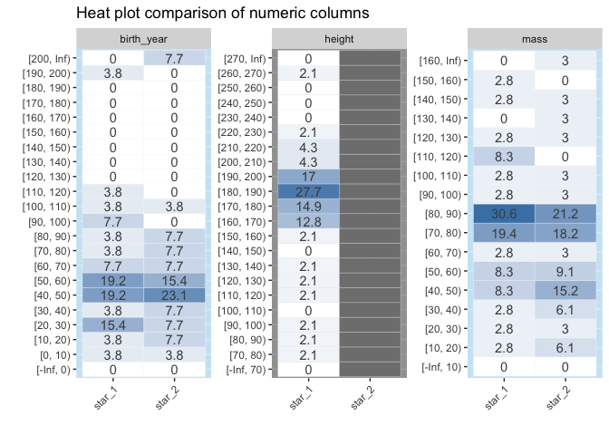

# inspectdf 

[](https://travis-ci.org/alastairrushworth/inspectdf)  
[](https://codecov.io/gh/alastairrushworth/inspectdf)
[](https://cran.r-project.org/package=inspectdf)
[](https://cran.r-project.org/package=inspectdf)

## Overview

`inspectdf` is collection of utilities for columnwise summary,
comparison and visualisation of data frames. Functions are provided to
summarise missingness, categorical levels, numeric distribution,
correlation, column types and memory usage.

The package has three aims:

  - to speed up repetitive checking and exploratory tasks for data
    frames  
  - to make it easier to compare data frames for differences and
    inconsistencies
  - to support quick visualisation of data frames

## Key functions

  - [`inspect_types()`](#column-types) summary of column types
  - [`inspect_mem()`](#memory-usage) summary of memory usage of columns
  - [`inspect_na()`](#missing-values) columnwise prevalence of missing
    values
  - [`inspect_cor()`](#correlation) correlation coefficients of numeric
    columns
  - [`inspect_imb()`](#feature-imbalance) feature imbalance of
    categorical columns
  - [`inspect_num()`](#numeric-summaries) summaries of numeric columns
  - [`inspect_cat()`](#categorical-levels) summaries of categorical
    columns

## Installation

To install the development version of the package, use

``` r
devtools::install_github("alastairrushworth/inspectdf")

# load the package
library(inspectdf)
```

## Illustrative data: `starwars`

The examples below make use of the `starwars` data from the `dplyr`
package

``` r
# some example data
data(starwars, package = "dplyr")
```

For illustrating comparisons of dataframes, use the `starwars` data and
produce two new dataframes `star_1` and `star_2` that randomly sample
the rows of the original and drop a couple of columns.

``` r
library(dplyr)
star_1 <- starwars %>% sample_n(50)
star_2 <- starwars %>% sample_n(50) %>% select(-1, -2)
```

#### Column types

##### `inspect_types()` for a single dataframe

To explore the column types in a data frame, use the function
`inspect_types()`. The command returns a `tibble` summarising the counts
and percentages of columns with particular types. A barplot is also
returned when `show_plot = TRUE`.

``` r
# return tibble and visualisation of columns types
inspect_types(starwars, show_plot = TRUE)
```

<!-- -->

    ## # A tibble: 4 x 4
    ##   type        cnt  pcnt col_name 
    ##   <chr>     <int> <dbl> <list>   
    ## 1 character     7 53.8  <chr [7]>
    ## 2 list          3 23.1  <chr [3]>
    ## 3 numeric       2 15.4  <chr [2]>
    ## 4 integer       1  7.69 <chr [1]>

##### `inspect_types()` for two dataframes

When a second dataframe is provided, `inspect_types()` will create a
dataframe comparing the count and percentage of each column type for
each of the input dataframes. The summaries for the first and second
dataframes are show in columns with names appended with `_1` and `_2`,
respectively.

``` r
inspect_types(star_1, star_2, show_plot = TRUE)
```

<!-- -->

    ## # A tibble: 4 x 5
    ##   type      cnt_1 pcnt_1 cnt_2 pcnt_2
    ##   <chr>     <int>  <dbl> <dbl>  <dbl>
    ## 1 character     7  53.8      6   54.5
    ## 2 list          3  23.1      3   27.3
    ## 3 numeric       2  15.4      2   18.2
    ## 4 integer       1   7.69     0    0

#### Memory usage

##### `inspect_mem()` for a single dataframe

To explore the memory usage of the columns in a data frame, use
`inspect_mem()`. The command returns a `tibble` containing the size of
each column in the dataframe. A barplot is also returned when `show_plot
= TRUE`.

``` r
inspect_mem(starwars, show_plot = TRUE)
```

<!-- -->

    ## # A tibble: 13 x 3
    ##    col_name   size        pcnt
    ##    <chr>      <chr>      <dbl>
    ##  1 films      19.54 Kb  36.5  
    ##  2 starships  7.27 Kb   13.6  
    ##  3 name       6.13 Kb   11.5  
    ##  4 vehicles   5.8 Kb    10.8  
    ##  5 homeworld  3.52 Kb    6.58 
    ##  6 species    2.88 Kb    5.39 
    ##  7 skin_color 2.59 Kb    4.85 
    ##  8 eye_color  1.57 Kb    2.93 
    ##  9 hair_color 1.41 Kb    2.63 
    ## 10 gender     976 bytes  1.78 
    ## 11 mass       744 bytes  1.36 
    ## 12 birth_year 744 bytes  1.36 
    ## 13 height     400 bytes  0.730

##### `inspect_mem()` for two dataframes

When a second dataframe is provided, `inspect_mem()` will create a
dataframe comparing the size of each column for both input dataframes.
The summaries for the first and second dataframes are show in columns
with names appended with `_1` and `_2`, respectively.

``` r
inspect_mem(star_1, star_2, show_plot = TRUE)
```

<!-- -->

    ## # A tibble: 13 x 5
    ##    col_name   size_1    size_2    pcnt_1 pcnt_2
    ##    <chr>      <chr>     <chr>      <dbl>  <dbl>
    ##  1 films      10.61 Kb  11.58 Kb  33.8    41.1 
    ##  2 starships  4.27 Kb   4.26 Kb   13.6    15.1 
    ##  3 name       3.55 Kb   <NA>      11.3    NA   
    ##  4 vehicles   3.47 Kb   3.32 Kb   11.0    11.8 
    ##  5 homeworld  2.2 Kb    2.08 Kb    6.98    7.38
    ##  6 skin_color 1.9 Kb    1.66 Kb    6.04    5.89
    ##  7 species    1.84 Kb   1.72 Kb    5.84    6.11
    ##  8 hair_color 960 bytes 968 bytes  2.98    3.36
    ##  9 eye_color  960 bytes 1.05 Kb    2.98    3.72
    ## 10 gender     616 bytes 680 bytes  1.91    2.36
    ## 11 mass       448 bytes 448 bytes  1.39    1.55
    ## 12 birth_year 448 bytes 448 bytes  1.39    1.55
    ## 13 height     248 bytes <NA>       0.771  NA

#### Missing values

##### `inspect_na()` for a single dataframe

`inspect_na()` summarises the prevalence of missing values by each
column in a data frame. A tibble containing the count (`cnt`) and the
overall percentage (`pcnt`) of missing values is returned A barplot is
also returned when `show_plot` is set to `TRUE`.

``` r
inspect_na(starwars, show_plot = TRUE)
```

<!-- -->

    ## # A tibble: 13 x 3
    ##    col_name     cnt  pcnt
    ##    <chr>      <dbl> <dbl>
    ##  1 birth_year    44 50.6 
    ##  2 mass          28 32.2 
    ##  3 homeworld     10 11.5 
    ##  4 height         6  6.90
    ##  5 hair_color     5  5.75
    ##  6 species        5  5.75
    ##  7 gender         3  3.45
    ##  8 name           0  0   
    ##  9 skin_color     0  0   
    ## 10 eye_color      0  0   
    ## 11 films          0  0   
    ## 12 vehicles       0  0   
    ## 13 starships      0  0

##### `inspect_na()` for two dataframes

When a second dataframe is provided, `inspect_na()` returns a tibble
containing counts and percentage missingness by column, with summaries
for the first and second data frames are show in columns with names
appended with `_1` and `_2`, respectively. In addition, a \(p\)-value is
calculated which provides a measure of evidence of whether the
difference in missing values is significantly different.

``` r
inspect_na(star_1, star_2, show_plot = TRUE)
```

<!-- -->

    ## # A tibble: 13 x 6
    ##    col_name   cnt_1 pcnt_1 cnt_2 pcnt_2 p_value
    ##    <chr>      <dbl>  <dbl> <dbl>  <dbl>   <dbl>
    ##  1 birth_year    24     48    24     48   1    
    ##  2 mass          14     28    17     34   0.665
    ##  3 homeworld      5     10     5     10   1    
    ##  4 height         3      6    NA     NA  NA    
    ##  5 species        3      6     3      6   1    
    ##  6 hair_color     2      4     3      6   1.000
    ##  7 gender         2      4     2      4   1    
    ##  8 name           0      0    NA     NA  NA    
    ##  9 skin_color     0      0     0      0  NA    
    ## 10 eye_color      0      0     0      0  NA    
    ## 11 films          0      0     0      0  NA    
    ## 12 vehicles       0      0     0      0  NA    
    ## 13 starships      0      0     0      0  NA

Notes:

  - Smaller \(p\)-values indicate stronger evidence of a difference in
    the missingness rate for a single column
  - If a column appears in one data frame and not the other - for
    example `height` appears in `star_1` but nor `star_2`, then the
    corresponding `pcnt_`, `cnt_` and `p_value` columns will contain
    `NA`
  - Where the missingness is identically 0, the `p_value` is `NA`.
  - The visualisation illustrates the significance of the difference
    using a coloured bar overlay. Orange bars indicate evidence of
    equality or missingness, while blue bars indicate inequality. If a
    `p_value` cannot be calculated, no coloured bar is shown.
  - The significance level can be specified using the `alpha` argument
    to `inspect_na()`. The default is `alpha = 0.05`.

#### Correlation

##### `inspect_cor()` for a single dataframe

`inspect_cor()` returns a tibble containing Pearson’s correlation
coefficient, confidence intervals and \(p\)-values for pairs of numeric
columns . The function combines the functionality of `cor()` and
`cor.test()` in a more convenient wrapper. A point and whiskers plot is
also returned when `show_plot = TRUE`.

``` r
inspect_cor(starwars, show_plot = T)
```

<!-- -->

    ## # A tibble: 3 x 6
    ##   col_1      col_2    corr p_value  lower   upper
    ##   <chr>      <chr>   <dbl>   <dbl>  <dbl>   <dbl>
    ## 1 birth_year mass    0.478 0.00318  0.130  0.721 
    ## 2 birth_year height -0.400 0.00789 -0.651 -0.0690
    ## 3 mass       height  0.134 0.312   -0.163  0.409

Notes

  - The tibble is sorted in descending order of the absolute coefficient
    \(|\rho|\).
  - `inspect_cor` drops missing values prior to calculation of each
    correlation coefficient.  
  - The `p_value` is associated with the null hypothesis
    \(H_0: \rho = 0\).

##### `inspect_cor()` for two dataframes

When a second dataframe is provided, `inspect_cor()` returns a tibble
that compares correlation coefficients of the first dataframe to those
in the second. The `p_value` column contains a measure of evidence for
whether the two correlation coefficients are equal or not.

``` r
inspect_cor(star_1, star_2, show_plot = TRUE)
```

<!-- -->

    ## # A tibble: 3 x 5
    ##   col_1      col_2  corr_1 corr_2 p_value
    ##   <chr>      <chr>   <dbl>  <dbl>   <dbl>
    ## 1 mass       height  0.772 NA      NA    
    ## 2 birth_year height  0.498 NA      NA    
    ## 3 birth_year mass    0.237  0.476   0.180

Notes:

  - Smaller `p_value` indicates stronger evidence against the null
    hypothesis \(H_0: \rho_1 = \rho_2\) and an indication that the true
    correlation coefficients differ.
  - The visualisation illustrates the significance of the difference
    using a coloured bar overlay. Orange bars indicate evidence of
    equality of correlations, while blue bars indicate inequality. If a
    `p_value` cannot be calculated, no coloured bar is shown.
  - The significance level can be specified using the `alpha` argument
    to `inspect_cor()`. The default is `alpha = 0.05`.

#### Feature imbalance

##### `inspect_imb()` for a single dataframe

Understanding categorical columns that are dominated by a single level
can be useful. `inspect_imb()` returns a tibble containing categorical
column names (`col_name`); the most frequently occurring categorical
level in each column (`value`) and `pctn` & `cnt` the percentage and
count which the value occurs. The tibble is sorted in descending order
of `pcnt`. A barplot is also returned when `show_plot` is set to `TRUE`.

``` r
inspect_imb(starwars, show_plot = TRUE)
```

<!-- -->

    ## # A tibble: 7 x 4
    ##   col_name   value   pcnt   cnt
    ##   <chr>      <chr>  <dbl> <int>
    ## 1 gender     male   71.3     62
    ## 2 hair_color none   42.5     37
    ## 3 species    Human  40.2     35
    ## 4 eye_color  brown  24.1     21
    ## 5 skin_color fair   19.5     17
    ## 6 homeworld  Naboo  12.6     11
    ## 7 name       Ackbar  1.15     1

##### `inspect_imb()` for two dataframes

When a second dataframe is provided, `inspect_imb()` returns a tibble
that compares the frequency of the most common categorical values of the
first dataframe to those in the second. The `p_value` column contains a
measure of evidence for whether the true frequencies are equal or not.

``` r
inspect_imb(star_1, star_2, show_plot = TRUE)
```

<!-- -->

    ## # A tibble: 7 x 7
    ##   col_name   value  pcnt_1 cnt_1 pcnt_2 cnt_2 p_value
    ##   <chr>      <chr>   <dbl> <int>  <dbl> <int>   <dbl>
    ## 1 gender     male       74    37     68    34   0.659
    ## 2 hair_color none       38    19     38    19   1    
    ## 3 species    Human      38    19     46    23   0.543
    ## 4 eye_color  brown      26    13     30    15   0.824
    ## 5 skin_color fair       18     9     22    11   0.803
    ## 6 homeworld  Naboo      16     8     18     9   1.000
    ## 7 name       Ackbar      2     1     NA    NA  NA

  - Smaller `p_value` indicates stronger evidence against the null
    hypothesis that the true frequency of the most common values is the
    same.
  - The visualisation illustrates the significance of the difference
    using a coloured bar overlay. Orange bars indicate evidence of
    equality of the imbalance, while blue bars indicate inequality. If a
    `p_value` cannot be calculated, no coloured bar is shown.
  - The significance level can be specified using the `alpha` argument
    to `inspect_imb()`. The default is `alpha = 0.05`.

#### Numeric summaries

##### `inspect_num()` for a single dataframe

`inspect_num()` combining some of the functionality of `summary()` and
`hist()` by returning summaries of numeric columns. `inspect_num()`
returns standard numerical summaries (`min`, `q1`, `mean`,
`median`,`q3`, `max`, `sd`), but also the percentage of missing entries
(`pcnt_na`) and a simple histogram (`hist`). If `show_plot = TRUE` a
histogram is generated for each numeric feature.

``` r
inspect_num(starwars, show_plot = TRUE, breaks = 10)
```

<!-- -->

    ## # A tibble: 3 x 10
    ##   col_name     min    q1 median  mean    q3   max    sd pcnt_na hist       
    ##   <chr>      <dbl> <dbl>  <dbl> <dbl> <dbl> <dbl> <dbl>   <dbl> <list>     
    ## 1 birth_year     8  35       52  87.6  72     896 155.    50.6  <tibble [1…
    ## 2 height        66 167      180 174.  191     264  34.8    6.90 <tibble [1…
    ## 3 mass          15  55.6     79  97.3  84.5  1358 169.    32.2  <tibble [1…

The `hist` column is a list whose elements are tibbles each containing
the relative frequencies of bins for each feature. These tibbles are
used to generate the histograms when `show_plot = TRUE`. For example,
the histogram for `starwars$birth_year` is

``` r
inspect_num(starwars)$hist$birth_year
```

    ## # A tibble: 20 x 2
    ##    value        prop
    ##    <chr>       <dbl>
    ##  1 [-Inf, 0)  0     
    ##  2 [0, 50)    0.488 
    ##  3 [50, 100)  0.395 
    ##  4 [100, 150) 0.0465
    ##  5 [150, 200) 0     
    ##  6 [200, 250) 0.0233
    ##  7 [250, 300) 0     
    ##  8 [300, 350) 0     
    ##  9 [350, 400) 0     
    ## 10 [400, 450) 0     
    ## 11 [450, 500) 0     
    ## 12 [500, 550) 0     
    ## 13 [550, 600) 0     
    ## 14 [600, 650) 0.0233
    ## 15 [650, 700) 0     
    ## 16 [700, 750) 0     
    ## 17 [750, 800) 0     
    ## 18 [800, 850) 0     
    ## 19 [850, 900) 0.0233
    ## 20 [900, Inf) 0

##### `inspect_num()` for two dataframes

When comparing a pair of dataframes using `inspect_num()`, the
histograms of common numeric features are calculated, using identical
bins. The list columns `hist_1` and `hist_2` contain the histograms of
the features in the first and second dataframes. A formal statistical
comparison of each pair of histograms is calculated using Fisher’s exact
test, the resulting *p* value is reported in the column `fisher_p`.

When `show_plot = TRUE`, heat plot comparisons are returned for each
numeric column in each dataframe. Where a column is present in only one
of the dataframes, grey cells are shown in the comparison. The
significance of Fisher’s test is illustrated by coloured vertical bands
around each plot: if the colour is grey, no *p* value could be
calculated, if blue, the histograms are not found to be significantly
different otherwise the bands are red.

``` r
inspect_num(star_1, star_2, show_plot = TRUE)
```

<!-- -->

    ## # A tibble: 3 x 5
    ##   col_name   hist_1            hist_2               jsd fisher_p
    ##   <chr>      <list>            <list>             <dbl>    <dbl>
    ## 1 birth_year <tibble [22 × 2]> <tibble [22 × 2]>  0.146    0.265
    ## 2 height     <tibble [22 × 2]> <NULL>            NA       NA    
    ## 3 mass       <tibble [17 × 2]> <tibble [17 × 2]>  0.109    0.571

#### Categorical levels

##### `inspect_cat()` for a single dataframe

`inspect_cat()` returns a tibble summarising categorical features in a
data frame, combining the functionality of the `inspect_imb()` and
`table()` functions. If `show_plot = TRUE` a barplot is generated
showing the relative split. The tibble generated contains the columns

  - `col_name` name of each categorical column
  - `cnt` the number of unique levels in the feature
  - `common` the most common level (see also `inspect_imb()`)  
  - `common_pcnt` the percentage occurrence of the most dominant level  
  - `levels` a list of tibbles each containing frequency tabulations of
    all levels

<!-- end list -->

``` r
inspect_cat(starwars, show_plot = T)
```

<!-- -->

    ## # A tibble: 7 x 5
    ##   col_name     cnt common common_pcnt levels           
    ##   <chr>      <int> <chr>        <dbl> <list>           
    ## 1 eye_color     15 brown        24.1  <tibble [15 × 3]>
    ## 2 gender         5 male         71.3  <tibble [5 × 3]> 
    ## 3 hair_color    13 none         42.5  <tibble [13 × 3]>
    ## 4 homeworld     49 Naboo        12.6  <tibble [49 × 3]>
    ## 5 name          87 Ackbar        1.15 <tibble [87 × 3]>
    ## 6 skin_color    31 fair         19.5  <tibble [31 × 3]>
    ## 7 species       38 Human        40.2  <tibble [38 × 3]>

For example, the levels for the `hair_color` column are

``` r
inspect_cat(starwars)$levels$hair_color
```

    ## # A tibble: 13 x 3
    ##    value           prop   cnt
    ##    <chr>          <dbl> <int>
    ##  1 none          0.425     37
    ##  2 brown         0.207     18
    ##  3 black         0.149     13
    ##  4 <NA>          0.0575     5
    ##  5 white         0.0460     4
    ##  6 blond         0.0345     3
    ##  7 auburn        0.0115     1
    ##  8 auburn, grey  0.0115     1
    ##  9 auburn, white 0.0115     1
    ## 10 blonde        0.0115     1
    ## 11 brown, grey   0.0115     1
    ## 12 grey          0.0115     1
    ## 13 unknown       0.0115     1

Note that by default, if `NA` values are present, they are counted as a
distinct categorical level.

##### `inspect_cat()` for two dataframes

When two dataframes are compared using `inspect_cat()`, list columns are
returned for categorical columns common to both: `lvls_1` and `lvl2_2`.
In addition, the Jensen-Shannon divergence (`jsd`) and *p* values
associated with Fisher’s exact test (`fisher_p`) are returned to enable
comparison of the distribution of levels in each pair of columns.

``` r
inspect_cat(star_1, star_2, show_plot = TRUE)
```

<!-- -->

    ## # A tibble: 7 x 5
    ##   col_name       jsd fisher_p lvls_1            lvls_2           
    ##   <chr>        <dbl>    <dbl> <list>            <list>           
    ## 1 eye_color   0.0551    0.971 <tibble [9 × 3]>  <tibble [11 × 3]>
    ## 2 gender      0.0122    0.927 <tibble [4 × 3]>  <tibble [5 × 3]> 
    ## 3 hair_color  0.0475    0.989 <tibble [10 × 3]> <tibble [10 × 3]>
    ## 4 homeworld   0.241     1     <tibble [31 × 3]> <tibble [29 × 3]>
    ## 5 name       NA        NA     <tibble [50 × 3]> <NULL>           
    ## 6 skin_color  0.122     0.999 <tibble [25 × 3]> <tibble [21 × 3]>
    ## 7 species     0.168     1     <tibble [25 × 3]> <tibble [23 × 3]>

When `show_plot = TRUE`, a barplot is returned comparing distributions
of levels in pairs of columns shared by the two dataframes.
