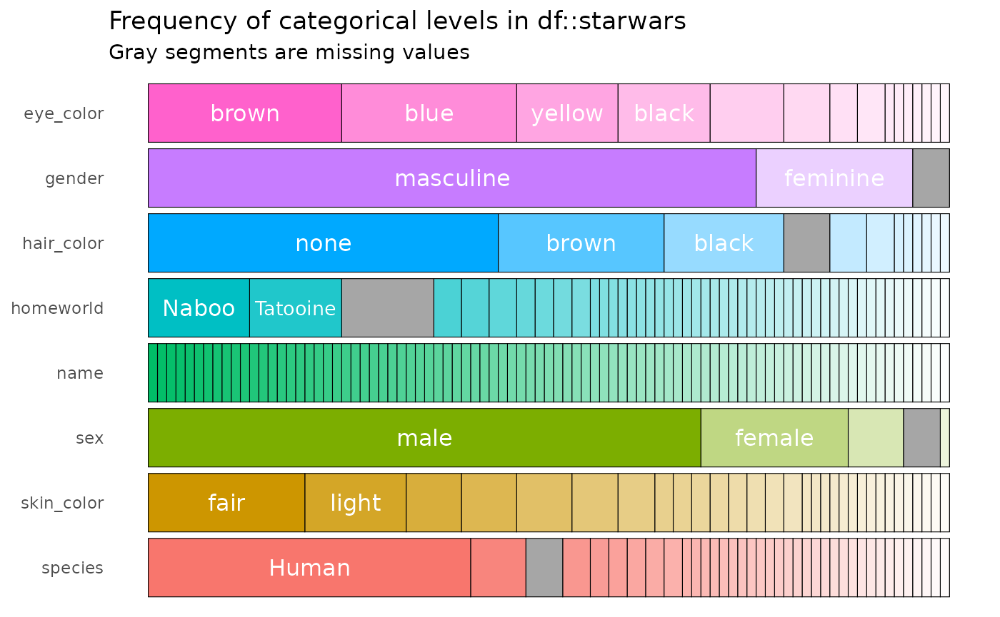
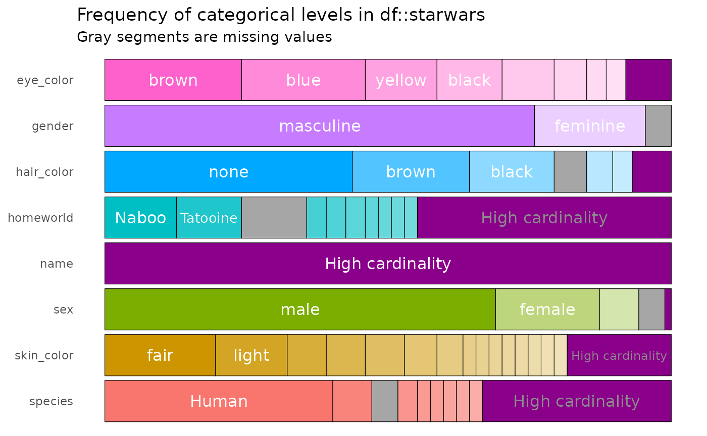

# Exploring and visualising categorical features

## Illustrative data: `starwars`

The examples below make use of the `starwars` from the `dplyr` package.

``` r

library(dplyr)
data(starwars, package = "dplyr")

# print the first few rows
head(starwars)
```

    ## # A tibble: 6 × 14
    ##   name      height  mass hair_color skin_color eye_color birth_year sex   gender
    ##   <chr>      <int> <dbl> <chr>      <chr>      <chr>          <dbl> <chr> <chr> 
    ## 1 Luke Sky…    172    77 blond      fair       blue            19   male  mascu…
    ## 2 C-3PO        167    75 NA         gold       yellow         112   none  mascu…
    ## 3 R2-D2         96    32 NA         white, bl… red             33   none  mascu…
    ## 4 Darth Va…    202   136 none       white      yellow          41.9 male  mascu…
    ## 5 Leia Org…    150    49 brown      light      brown           19   fema… femin…
    ## 6 Owen Lars    178   120 brown, gr… light      blue            52   male  mascu…
    ## # ℹ 5 more variables: homeworld <chr>, species <chr>, films <list>,
    ## #   vehicles <list>, starships <list>

## `inspect_cat()` for a single data frame

[`inspect_cat()`](https://alastairrushworth.com/inspectdf/reference/inspect_cat.md)
returns a tibble summarising categorical features in a data frame,
combining the functionality of the
[`inspect_imb()`](https://alastairrushworth.com/inspectdf/reference/inspect_imb.md)
and [`table()`](https://rdrr.io/r/base/table.html) functions. The tibble
generated contains the columns

- `col_name` name of each categorical column
- `cnt` the number of unique levels in the feature
- `common` the most common level (see also
  [`inspect_imb()`](https://alastairrushworth.com/inspectdf/reference/inspect_imb.md))  
- `common_pcnt` the percentage occurrence of the most dominant level  
- `levels` a list of tibbles each containing frequency tabulations of
  all levels

``` r

library(inspectdf)

# explore the categorical features 
x <- inspect_cat(starwars)
x
```

    ## # A tibble: 8 × 5
    ##   col_name     cnt common    common_pcnt levels           
    ##   <chr>      <int> <chr>           <dbl> <named list>     
    ## 1 eye_color     15 brown           24.1  <tibble [15 × 3]>
    ## 2 gender         3 masculine       75.9  <tibble [3 × 3]> 
    ## 3 hair_color    12 none            43.7  <tibble [12 × 3]>
    ## 4 homeworld     49 Naboo           12.6  <tibble [49 × 3]>
    ## 5 name          87 Ackbar           1.15 <tibble [87 × 3]>
    ## 6 sex            5 male            69.0  <tibble [5 × 3]> 
    ## 7 skin_color    31 fair            19.5  <tibble [31 × 3]>
    ## 8 species       38 Human           40.2  <tibble [38 × 3]>

For example, the levels for the `hair_color` column are

``` r

# show frequency tibble for `hair_color` column:
x$levels$hair_color
```

    ## # A tibble: 12 × 3
    ##    value           prop   cnt
    ##    <chr>          <dbl> <int>
    ##  1 none          0.437     38
    ##  2 brown         0.207     18
    ##  3 black         0.149     13
    ##  4 NA            0.0575     5
    ##  5 white         0.0460     4
    ##  6 blond         0.0345     3
    ##  7 auburn        0.0115     1
    ##  8 auburn, grey  0.0115     1
    ##  9 auburn, white 0.0115     1
    ## 10 blonde        0.0115     1
    ## 11 brown, grey   0.0115     1
    ## 12 grey          0.0115     1

Note that by default, if missing (`NA`) values are present, they are
counted as a distinct categorical level. A barplot showing the
composition of each categorical column can be created using the
[`show_plot()`](https://alastairrushworth.com/inspectdf/reference/show_plot.md)
function. Note how missing values are shown as grey bars:

``` r

x %>% show_plot()
```



The argument `high_cardinality` in the
[`show_plot()`](https://alastairrushworth.com/inspectdf/reference/show_plot.md)
function can be used to bundle together categories that occur only a
small number of times. For example, to combine categories only occurring
once, use:

``` r

x %>% 
  show_plot(high_cardinality = 1)
```



The resulting bundles are shown in purple.

## `inspect_cat()` for two data frames

To illustrate the comparison of two data frames, we first create two new
data frames by randomly sampling the rows of `starwars` and also
dropping some of the columns. The results are assigned to the objects
`star_1` and `star_2`:

``` r

# sample 50 rows from `starwars`
star_1 <- starwars %>% sample_n(50)
# sample 50 rows from `starwars` and drop the first two columns
star_2 <- starwars %>% sample_n(50) %>% select(-1, -2)
```

To compare the character columns in a pair of data frames, use the
[`inspect_cat()`](https://alastairrushworth.com/inspectdf/reference/inspect_cat.md):

``` r

inspect_cat(star_1, star_2)
```

    ## # A tibble: 8 × 5
    ##   col_name        jsd   pval lvls_1            lvls_2           
    ##   <chr>         <dbl>  <dbl> <named list>      <named list>     
    ## 1 eye_color   0.0958   0.450 <tibble [14 × 3]> <tibble [10 × 3]>
    ## 2 gender      0.00155  0.899 <tibble [3 × 3]>  <tibble [3 × 3]> 
    ## 3 hair_color  0.0525   0.255 <tibble [9 × 3]>  <tibble [9 × 3]> 
    ## 4 homeworld   0.286    0.214 <tibble [33 × 3]> <tibble [25 × 3]>
    ## 5 name       NA       NA     <tibble [50 × 3]> <NULL>           
    ## 6 sex         0.00362  0.789 <tibble [4 × 3]>  <tibble [4 × 3]> 
    ## 7 skin_color  0.148    0.862 <tibble [24 × 3]> <tibble [24 × 3]>
    ## 8 species     0.216    1     <tibble [23 × 3]> <tibble [21 × 3]>

The tibble returned has the following columns

- `jsd`, the Jensen-Shannon divergence: a measure of how different the
  distribution of levels are between columns with the same name present
  in both data frames. Values are between 0 and 1 - values closer to 1
  indicate bigger differences in distribution.
- `pval`, *p* values associated with a modified $`\chi^2`$ test of the
  relative frequencies of levels in columns with the same name present
  in both data frames.  
- `lvls_1` and `lvl2_2` are named list columns containing the frequency
  tables for each column in the first and second data frame input to
  [`inspect_cat()`](https://alastairrushworth.com/inspectdf/reference/inspect_cat.md)
