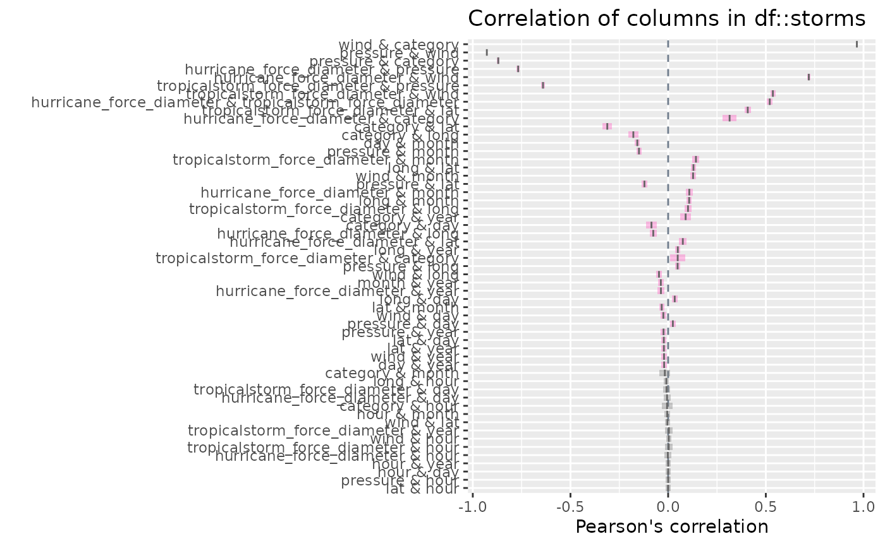
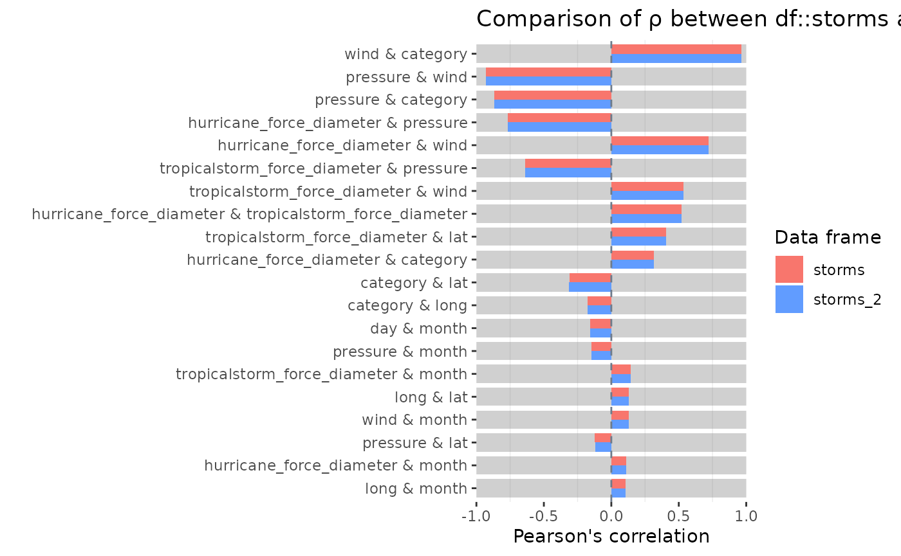

# Correlation diagnostics for numeric columns

## Illustrative data: `starwars`

The examples below make use of the `starwars` and `storms` data from the
`dplyr` package

``` r

# some example data
data(starwars, package = "dplyr")
data(storms, package = "dplyr")
```

For illustrating comparisons of dataframes, use the `starwars` data and
produce two new dataframes `star_1` and `star_2` that randomly sample
the rows of the original and drop a couple of columns.

``` r

library(dplyr)
star_1 <- starwars %>% sample_n(50)
star_2 <- starwars %>% sample_n(50) %>% select(-1, -2)
```

## `inspect_cor()` for a single dataframe

[`inspect_cor()`](https://alastairrushworth.github.io/inspectdf/reference/inspect_cor.md)
returns a tibble containing Pearson’s correlation coefficient,
confidence intervals and $`p`$-values for pairs of numeric columns . The
function combines the functionality of
[`cor()`](https://rdrr.io/r/stats/cor.html) and
[`cor.test()`](https://rdrr.io/r/stats/cor.test.html) in a more
convenient wrapper.

``` r

library(inspectdf)
inspect_cor(storms)
```

    ## # A tibble: 55 × 7
    ##    col_1                        col_2       corr  p_value  lower  upper pcnt_nna
    ##    <chr>                        <chr>      <dbl>    <dbl>  <dbl>  <dbl>    <dbl>
    ##  1 wind                         category   0.966 0         0.964  0.968     24.5
    ##  2 pressure                     wind      -0.928 0        -0.930 -0.926    100  
    ##  3 pressure                     category  -0.870 0        -0.876 -0.863     24.5
    ##  4 hurricane_force_diameter     pressure  -0.768 0        -0.775 -0.760     54.2
    ##  5 hurricane_force_diameter     wind       0.720 0         0.711  0.729     54.2
    ##  6 tropicalstorm_force_diameter pressure  -0.641 0        -0.651 -0.629     54.2
    ##  7 tropicalstorm_force_diameter wind       0.536 0         0.523  0.549     54.2
    ##  8 hurricane_force_diameter     tropical…  0.520 0         0.506  0.533     54.2
    ##  9 tropicalstorm_force_diameter lat        0.407 0         0.392  0.423     54.2
    ## 10 hurricane_force_diameter     category   0.315 5.59e-55  0.279  0.350     11.9
    ## # ℹ 45 more rows

A plot showing point estimate and confidence intervals is printed when
using the
[`show_plot()`](https://alastairrushworth.github.io/inspectdf/reference/show_plot.md)
function. Note that intervals that straddle the null value of 0 are
shown in gray:

``` r

inspect_cor(storms) %>% show_plot()
```



Notes:

- The tibble is sorted in descending order of the absolute coefficient
  $`|\rho|`$.
- `inspect_cor` drops missing values prior to calculation of each
  correlation coefficient.  
- The `p_value` is associated with the null hypothesis
  $`H_0: \rho = 0`$.

## `inspect_cor()` for two dataframes

When a second dataframe is provided,
[`inspect_cor()`](https://alastairrushworth.github.io/inspectdf/reference/inspect_cor.md)
returns a tibble that compares correlation coefficients of the first
dataframe to those in the second. The `p_value` column contains a
measure of evidence for whether the two correlation coefficients are
equal or not.

``` r

inspect_cor(storms, storms[-c(1:200), ])
```

    ## # A tibble: 55 × 5
    ##    col_1                        col_2                      corr_1 corr_2 p_value
    ##    <chr>                        <chr>                       <dbl>  <dbl>   <dbl>
    ##  1 wind                         category                    0.966  0.966   0.869
    ##  2 pressure                     wind                       -0.928 -0.928   0.888
    ##  3 pressure                     category                   -0.870 -0.870   0.913
    ##  4 hurricane_force_diameter     pressure                   -0.768 -0.768   1    
    ##  5 hurricane_force_diameter     wind                        0.720  0.720   1    
    ##  6 tropicalstorm_force_diameter pressure                   -0.641 -0.641   1    
    ##  7 tropicalstorm_force_diameter wind                        0.536  0.536   1    
    ##  8 hurricane_force_diameter     tropicalstorm_force_diame…  0.520  0.520   1    
    ##  9 tropicalstorm_force_diameter lat                         0.407  0.407   1    
    ## 10 hurricane_force_diameter     category                    0.315  0.315   1    
    ## # ℹ 45 more rows

To plot the comparison of the top 20 correlation coefficients:

``` r

inspect_cor(storms, storms[-c(1:200), ]) %>% 
  slice(1:20) %>%
  show_plot()
```



Notes:

- Smaller `p_value` indicates stronger evidence against the null
  hypothesis $`H_0: \rho_1 = \rho_2`$ and an indication that the true
  correlation coefficients differ.
- The visualisation illustrates the significance of the difference using
  a coloured bar underlay. Coloured bars indicate evidence of inequality
  of correlations, while gray bars indicate equality.  
- For a pair of features, if either coefficient is `NA`, the comparison
  is omitted from the visualisation.
- The significance level can be specified using the `alpha` argument to
  [`inspect_cor()`](https://alastairrushworth.github.io/inspectdf/reference/inspect_cor.md).
  The default is `alpha = 0.05`.
