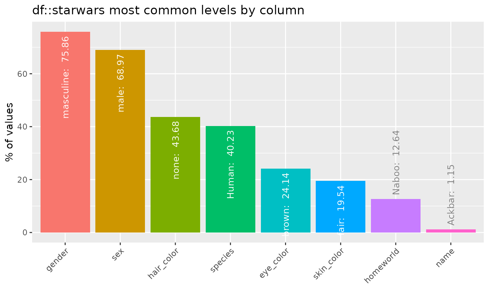
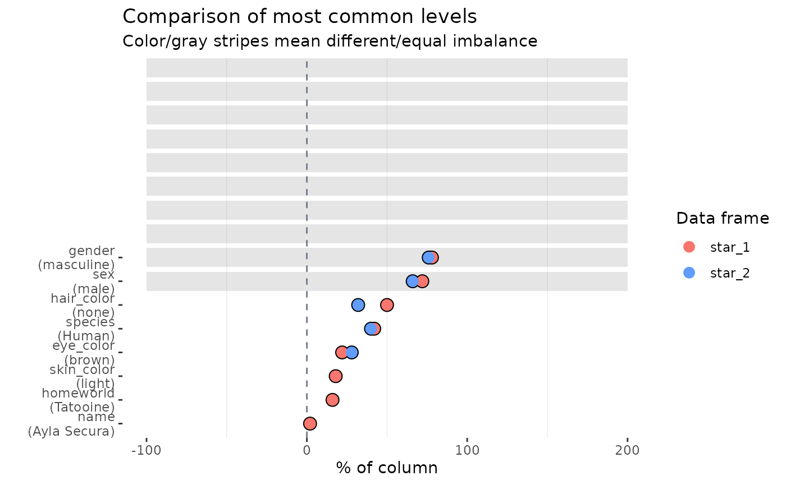

# Feature imbalance for categorical columns

## Illustrative data: `starwars`

The examples below make use of the `starwars` and `storms` data from the
`dplyr` package

``` r

# some example data
data(starwars, package = "dplyr")
data(storms, package = "dplyr")
```

For illustrating comparisons of dataframes, use the `starwars` data and
produce two new dataframes `star_1` and `star_2` that randomly sample
the rows of the original and drop a couple of columns.

``` r

library(dplyr)
star_1 <- starwars %>% sample_n(50)
star_2 <- starwars %>% sample_n(50) %>% select(-1, -2)
```

## `inspect_imb()` for a single dataframe

Understanding categorical columns that are dominated by a single level
can be useful.
[`inspect_imb()`](https://alastairrushworth.com/inspectdf/reference/inspect_imb.md)
returns a tibble containing categorical column names (`col_name`); the
most frequently occurring categorical level in each column (`value`) and
`pctn` & `cnt` the percentage and count which the value occurs. The
tibble is sorted in descending order of `pcnt`.

``` r

library(inspectdf)
inspect_imb(starwars)
```

    ## # A tibble: 8 × 4
    ##   col_name   value      pcnt   cnt
    ##   <chr>      <chr>     <dbl> <int>
    ## 1 gender     masculine 75.9     66
    ## 2 sex        male      69.0     60
    ## 3 hair_color none      43.7     38
    ## 4 species    Human     40.2     35
    ## 5 eye_color  brown     24.1     21
    ## 6 skin_color fair      19.5     17
    ## 7 homeworld  Naboo     12.6     11
    ## 8 name       Ackbar     1.15     1

A barplot is printed by passing the result to the
[`show_plot()`](https://alastairrushworth.com/inspectdf/reference/show_plot.md)
function:

``` r

inspect_imb(starwars) %>% show_plot()
```



## `inspect_imb()` for two dataframes

When a second dataframe is provided,
[`inspect_imb()`](https://alastairrushworth.com/inspectdf/reference/inspect_imb.md)
returns a tibble that compares the frequency of the most common
categorical values of the first dataframe to those in the second. The
`p_value` column contains a measure of evidence for whether the true
frequencies are equal or not.

``` r

inspect_imb(star_1, star_2)
```

    ## # A tibble: 8 × 7
    ##   col_name   value       pcnt_1 cnt_1 pcnt_2 cnt_2 p_value
    ##   <chr>      <chr>        <dbl> <int>  <dbl> <int>   <dbl>
    ## 1 gender     masculine       78    39     76    38   1    
    ## 2 sex        male            72    36     66    33   0.665
    ## 3 hair_color none            50    25     32    16   0.104
    ## 4 species    Human           42    21     40    20   1.000
    ## 5 eye_color  brown           22    11     28    14   0.644
    ## 6 skin_color light           18     9     NA    NA  NA    
    ## 7 homeworld  Tatooine        16     8     NA    NA  NA    
    ## 8 name       Ayla Secura      2     1     NA    NA  NA

``` r

inspect_imb(star_1, star_2) %>% show_plot()
```



- Smaller `p_value` indicates stronger evidence against the null
  hypothesis that the true frequency of the most common values is the
  same.
- The visualisation illustrates the significance of the difference using
  a coloured bar overlay. Orange bars indicate evidence of equality of
  the imbalance, while blue bars indicate inequality. If a `p_value`
  cannot be calculated, no coloured bar is shown.
- The significance level can be specified using the `alpha` argument to
  [`inspect_imb()`](https://alastairrushworth.com/inspectdf/reference/inspect_imb.md).
  The default is `alpha = 0.05`.
