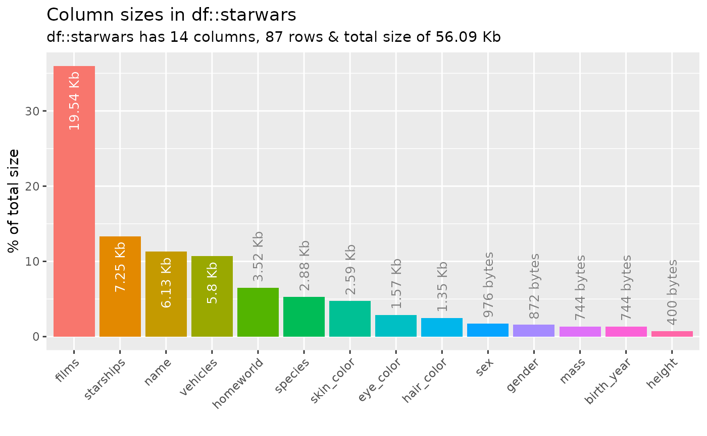
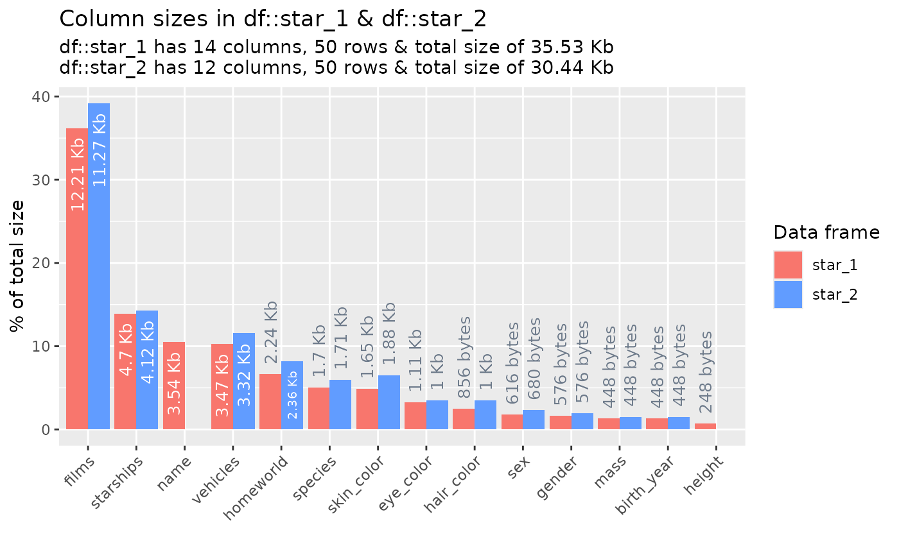

# Memory usage of dataframe columns

## Illustrative data: `starwars`

The examples below make use of the `starwars` and `storms` data from the
`dplyr` package

``` r

# some example data
data(starwars, package = "dplyr")
data(storms, package = "dplyr")
```

For illustrating comparisons of dataframes, use the `starwars` data and
produce two new dataframes `star_1` and `star_2` that randomly sample
the rows of the original and drop a couple of columns.

``` r

library(dplyr)
star_1 <- starwars %>% sample_n(50)
star_2 <- starwars %>% sample_n(50) %>% select(-1, -2)
```

## Illustrative data: `starwars`

The examples below make use of the `starwars` and `storms` data from the
`dplyr` package

``` r

# some example data
data(starwars, package = "dplyr")
data(storms, package = "dplyr")
```

For illustrating comparisons of dataframes, use the `starwars` data and
produce two new dataframes `star_1` and `star_2` that randomly sample
the rows of the original and drop a couple of columns.

``` r

library(dplyr)
star_1 <- starwars %>% sample_n(50)
star_2 <- starwars %>% sample_n(50) %>% select(-1, -2)
```

## `inspect_mem()` for a single dataframe

To explore the memory usage of the columns in a data frame, use
[`inspect_mem()`](https://alastairrushworth.com/inspectdf/reference/inspect_mem.md).
The command returns a `tibble` containing the size of each column in the
dataframe.

``` r

library(inspectdf)
inspect_mem(starwars)
```

    ## # A tibble: 14 × 4
    ##    col_name   bytes size        pcnt
    ##    <chr>      <int> <chr>      <dbl>
    ##  1 films      20008 19.54 Kb  36.0  
    ##  2 starships   7424 7.25 Kb   13.4  
    ##  3 name        6280 6.13 Kb   11.3  
    ##  4 vehicles    5944 5.8 Kb    10.7  
    ##  5 homeworld   3608 3.52 Kb    6.49 
    ##  6 species     2952 2.88 Kb    5.31 
    ##  7 skin_color  2656 2.59 Kb    4.78 
    ##  8 eye_color   1608 1.57 Kb    2.89 
    ##  9 hair_color  1384 1.35 Kb    2.49 
    ## 10 sex          976 976 bytes  1.76 
    ## 11 gender       872 872 bytes  1.57 
    ## 12 mass         744 744 bytes  1.34 
    ## 13 birth_year   744 744 bytes  1.34 
    ## 14 height       400 400 bytes  0.719

A barplot can be produced by passing the result to
[`show_plot()`](https://alastairrushworth.com/inspectdf/reference/show_plot.md):

``` r

inspect_mem(starwars) %>% show_plot()
```



## `inspect_mem()` for two dataframes

When a second dataframe is provided,
[`inspect_mem()`](https://alastairrushworth.com/inspectdf/reference/inspect_mem.md)
will create a dataframe comparing the size of each column for both input
dataframes. The summaries for the first and second dataframes are show
in columns with names appended with `_1` and `_2`, respectively.

``` r

inspect_mem(star_1, star_2)
```

    ## # A tibble: 14 × 5
    ##    col_name   size_1    size_2    pcnt_1 pcnt_2
    ##    <chr>      <chr>     <chr>      <dbl>  <dbl>
    ##  1 films      12.21 Kb  11.27 Kb  36.2    39.2 
    ##  2 starships  4.7 Kb    4.12 Kb   13.9    14.3 
    ##  3 name       3.54 Kb   NA        10.5    NA   
    ##  4 vehicles   3.47 Kb   3.32 Kb   10.3    11.5 
    ##  5 homeworld  2.24 Kb   2.36 Kb    6.65    8.21
    ##  6 species    1.7 Kb    1.71 Kb    5.05    5.95
    ##  7 skin_color 1.65 Kb   1.88 Kb    4.89    6.52
    ##  8 eye_color  1.11 Kb   1 Kb       3.29    3.48
    ##  9 hair_color 856 bytes 1 Kb       2.48    3.48
    ## 10 sex        616 bytes 680 bytes  1.78    2.31
    ## 11 gender     576 bytes 576 bytes  1.67    1.96
    ## 12 mass       448 bytes 448 bytes  1.30    1.52
    ## 13 birth_year 448 bytes 448 bytes  1.30    1.52
    ## 14 height     248 bytes NA         0.718  NA

``` r

inspect_mem(star_1, star_2) %>% show_plot()
```


