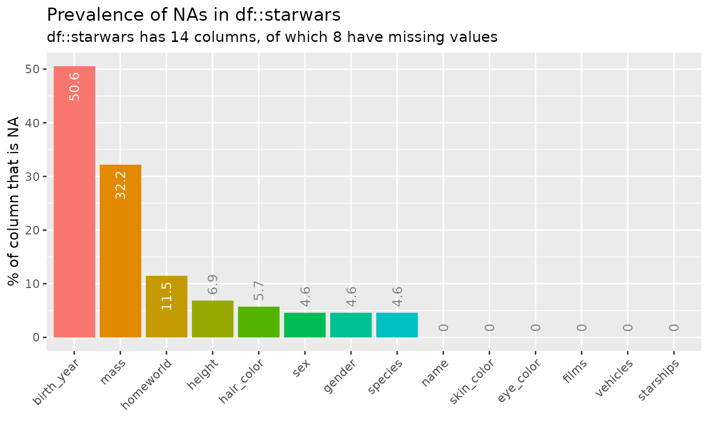
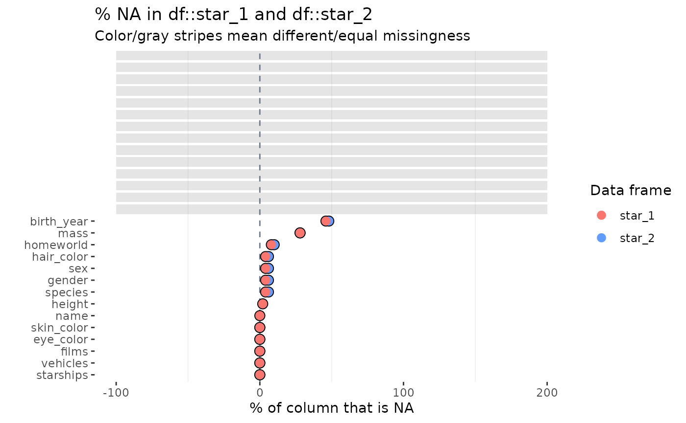

# Missingness and counting NAs

## Illustrative data: `starwars`

The examples below make use of the `starwars` and `storms` data from the
`dplyr` package

``` r

# some example data
data(starwars, package = "dplyr")
data(storms, package = "dplyr")
```

For illustrating comparisons of dataframes, use the `starwars` data and
produce two new dataframes `star_1` and `star_2` that randomly sample
the rows of the original and drop a couple of columns.

``` r

library(dplyr)
star_1 <- starwars %>% sample_n(50)
star_2 <- starwars %>% sample_n(50) %>% select(-1, -2)
```

## `inspect_na()` for a single dataframe

[`inspect_na()`](https://alastairrushworth.com/inspectdf/reference/inspect_na.md)
summarises the prevalence of missing values by each column in a data
frame. A tibble containing the count (`cnt`) and the overall percentage
(`pcnt`) of missing values is returned.

``` r

library(inspectdf)
inspect_na(starwars)
```

    ## # A tibble: 14 × 3
    ##    col_name     cnt  pcnt
    ##    <chr>      <int> <dbl>
    ##  1 birth_year    44 50.6 
    ##  2 mass          28 32.2 
    ##  3 homeworld     10 11.5 
    ##  4 height         6  6.90
    ##  5 hair_color     5  5.75
    ##  6 sex            4  4.60
    ##  7 gender         4  4.60
    ##  8 species        4  4.60
    ##  9 name           0  0   
    ## 10 skin_color     0  0   
    ## 11 eye_color      0  0   
    ## 12 films          0  0   
    ## 13 vehicles       0  0   
    ## 14 starships      0  0

A barplot can be produced by passing the result to
[`show_plot()`](https://alastairrushworth.com/inspectdf/reference/show_plot.md):

``` r

inspect_na(starwars) %>% show_plot()
```



## `inspect_na()` for two dataframes

When a second dataframe is provided,
[`inspect_na()`](https://alastairrushworth.com/inspectdf/reference/inspect_na.md)
returns a tibble containing counts and percentage missingness by column,
with summaries for the first and second data frames are show in columns
with names appended with `_1` and `_2`, respectively. In addition, a
$`p`$-value is calculated which provides a measure of evidence of
whether the difference in missing values is significantly different.

``` r

inspect_na(star_1, star_2)
```

    ## # A tibble: 14 × 6
    ##    col_name   cnt_1 pcnt_1 cnt_2 pcnt_2 p_value
    ##    <chr>      <int>  <dbl> <int>  <dbl>   <dbl>
    ##  1 birth_year    23     46    24     48    1   
    ##  2 mass          14     28    14     28    1.00
    ##  3 homeworld      4      8     5     10    1   
    ##  4 hair_color     2      4     3      6    1   
    ##  5 sex            2      4     3      6    1   
    ##  6 gender         2      4     3      6    1   
    ##  7 species        2      4     3      6    1   
    ##  8 height         1      2    NA     NA   NA   
    ##  9 name           0      0    NA     NA   NA   
    ## 10 skin_color     0      0     0      0   NA   
    ## 11 eye_color      0      0     0      0   NA   
    ## 12 films          0      0     0      0   NA   
    ## 13 vehicles       0      0     0      0   NA   
    ## 14 starships      0      0     0      0   NA

``` r

inspect_na(star_1, star_2) %>% show_plot()
```



Notes:

- Smaller $`p`$-values indicate stronger evidence of a difference in the
  missingness rate for a single column
- If a column appears in one data frame and not the other - for example
  `height` appears in `star_1` but nor `star_2`, then the corresponding
  `pcnt_`, `cnt_` and `p_value` columns will contain `NA`
- Where the missingness is identically 0, the `p_value` is `NA`.
- The visualisation illustrates the significance of the difference using
  a coloured bar overlay. Orange bars indicate evidence of equality or
  missingness, while blue bars indicate inequality. If a `p_value`
  cannot be calculated, no coloured bar is shown.
- The significance level can be specified using the `alpha` argument to
  [`inspect_na()`](https://alastairrushworth.com/inspectdf/reference/inspect_na.md).
  The default is `alpha = 0.05`.
