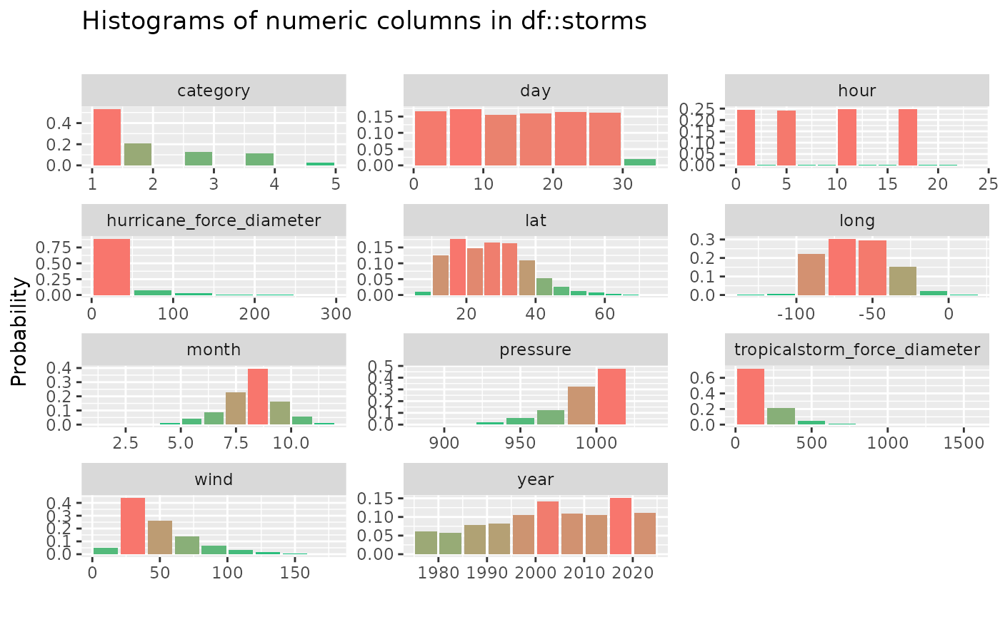
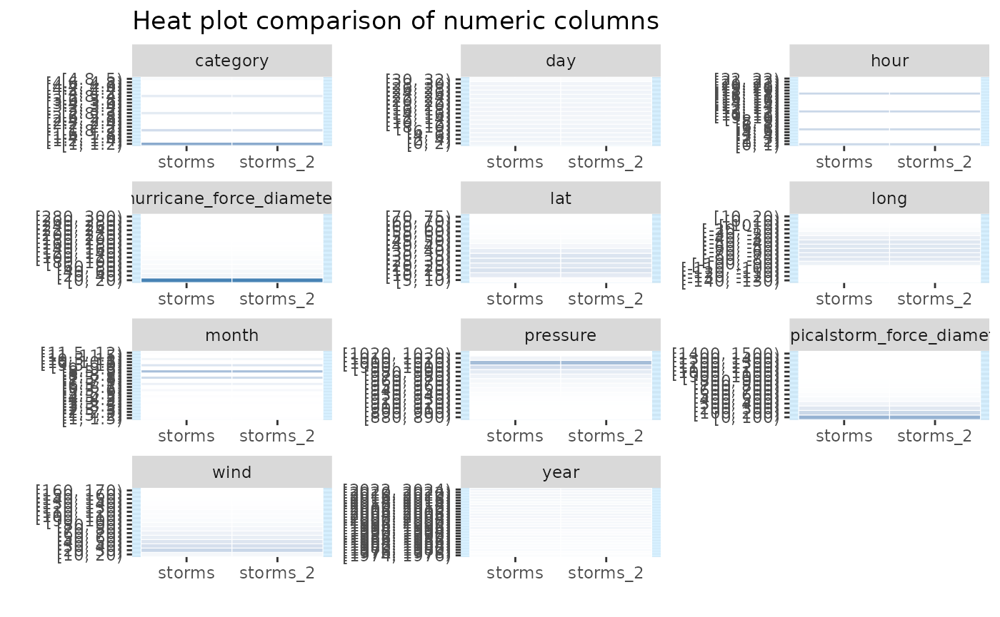

# Numeric column summaries and visualisations

## Illustrative data: `starwars`

The examples below make use of the `starwars` and `storms` data from the
`dplyr` package

``` r

# some example data
data(starwars, package = "dplyr")
data(storms, package = "dplyr")
```

For illustrating comparisons of dataframes, use the `starwars` data and
produce two new dataframes `star_1` and `star_2` that randomly sample
the rows of the original and drop a couple of columns.

``` r

library(dplyr)
star_1 <- starwars %>% sample_n(50)
star_2 <- starwars %>% sample_n(50) %>% select(-1, -2)
```

## `inspect_num()` for a single dataframe

[`inspect_num()`](https://alastairrushworth.com/inspectdf/reference/inspect_num.md)
combining some of the functionality of
[`summary()`](https://rdrr.io/r/base/summary.html) and
[`hist()`](https://rdrr.io/r/graphics/hist.html) by returning summaries
of numeric columns.
[`inspect_num()`](https://alastairrushworth.com/inspectdf/reference/inspect_num.md)
returns standard numerical summaries (`min`, `q1`, `mean`,
`median`,`q3`, `max`, `sd`), but also the percentage of missing entries
(`pcnt_na`) and a simple histogram (`hist`).

``` r

library(inspectdf)
inspect_num(storms, breaks = 10)
```

    ## # A tibble: 11 × 10
    ##    col_name      min     q1 median    mean     q3    max     sd pcnt_na hist    
    ##    <chr>       <dbl>  <dbl>  <dbl>   <dbl>  <dbl>  <dbl>  <dbl>   <dbl> <named >
    ##  1 year        1975  1995   2005   2004.   2016   2024    13.3      0   <tibble>
    ##  2 month          1     8      9      8.71    9     12     1.34     0   <tibble>
    ##  3 day            1     8     16     15.7    24     31     8.91     0   <tibble>
    ##  4 hour           0     5     12      9.10   18     23     6.74     0   <tibble>
    ##  5 lat            7    18.3   26.4   26.9    33.8   70.7  10.5      0   <tibble>
    ##  6 long        -137.  -78.6  -61.9  -61.3   -45.3   13.5  21.1      0   <tibble>
    ##  7 category       1     1      1      1.90    3      5     1.15    75.5 <tibble>
    ##  8 wind          10    30     45     50.1    65    165    25.5      0   <tibble>
    ##  9 pressure     882   986   1000    993.   1007   1024    18.8      0   <tibble>
    ## 10 tropicalst…    0     0    120    148.    220   1440   157.      45.8 <tibble>
    ## 11 hurricane_…    0     0      0     14.8     0    300    33.9     45.8 <tibble>

The `hist` column is a list whose elements are tibbles each containing
the relative frequencies of bins for each feature. These tibbles are
used to generate the histograms when `show_plot = TRUE`. For example,
the histogram for `starwars$birth_year` is

``` r

inspect_num(storms)$hist$pressure
```

    ## # A tibble: 15 × 2
    ##    value            prop
    ##    <chr>           <dbl>
    ##  1 [880, 890)   0.000144
    ##  2 [890, 900)   0.000481
    ##  3 [900, 910)   0.00120 
    ##  4 [910, 920)   0.00294 
    ##  5 [920, 930)   0.00505 
    ##  6 [930, 940)   0.0121  
    ##  7 [940, 950)   0.0230  
    ##  8 [950, 960)   0.0308  
    ##  9 [960, 970)   0.0498  
    ## 10 [970, 980)   0.0708  
    ## 11 [980, 990)   0.120   
    ## 12 [990, 1000)  0.205   
    ## 13 [1000, 1010) 0.408   
    ## 14 [1010, 1020) 0.0701  
    ## 15 [1020, 1030) 0.000914

A histogram is generated for each numeric feature by passing the result
to the
[`show_plot()`](https://alastairrushworth.com/inspectdf/reference/show_plot.md)
function:

``` r

inspect_num(storms, breaks = 10) %>%
  show_plot()
```



## `inspect_num()` for two dataframes

When comparing a pair of dataframes using
[`inspect_num()`](https://alastairrushworth.com/inspectdf/reference/inspect_num.md),
the histograms of common numeric features are calculated, using
identical bins. The list columns `hist_1` and `hist_2` contain the
histograms of the features in the first and second dataframes. A formal
statistical comparison of each pair of histograms is calculated using
Fisher’s exact test, the resulting *p* value is reported in the column
`fisher_p`.

When `show_plot = TRUE`, heat plot comparisons are returned for each
numeric column in each dataframe. Where a column is present in only one
of the dataframes, grey cells are shown in the comparison. The
significance of Fisher’s test is illustrated by coloured vertical bands
around each plot: if the colour is grey, no *p* value could be
calculated, if blue, the histograms are not found to be significantly
different otherwise the bands are red.

``` r

inspect_num(storms, storms[-c(1:10), -1])
```

    ## # A tibble: 11 × 5
    ##    col_name                     hist_1            hist_2               jsd  pval
    ##    <chr>                        <named list>      <named list>       <dbl> <dbl>
    ##  1 year                         <tibble [25 × 2]> <tibble>         2.38e-6 1    
    ##  2 month                        <tibble [22 × 2]> <tibble>         9.42e-7 1.000
    ##  3 day                          <tibble [16 × 2]> <tibble>         4.00e-7 1    
    ##  4 hour                         <tibble [23 × 2]> <tibble>         2.82e-9 1    
    ##  5 lat                          <tibble [14 × 2]> <tibble>         1.06e-7 1.000
    ##  6 long                         <tibble [16 × 2]> <tibble>         2.47e-7 1    
    ##  7 category                     <tibble [20 × 2]> <tibble>         0       1.000
    ##  8 wind                         <tibble [16 × 2]> <tibble>         7.64e-8 1.000
    ##  9 pressure                     <tibble [15 × 2]> <tibble>         2.60e-7 1    
    ## 10 tropicalstorm_force_diameter <tibble [15 × 2]> <tibble>         0       1    
    ## 11 hurricane_force_diameter     <tibble [15 × 2]> <tibble>         0       1

``` r

inspect_num(storms, storms[-c(1:10), -1]) %>% 
  show_plot()
```


