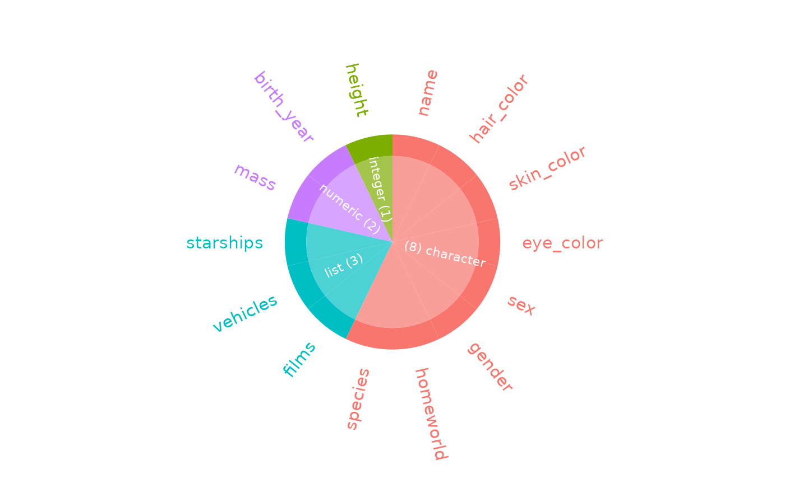
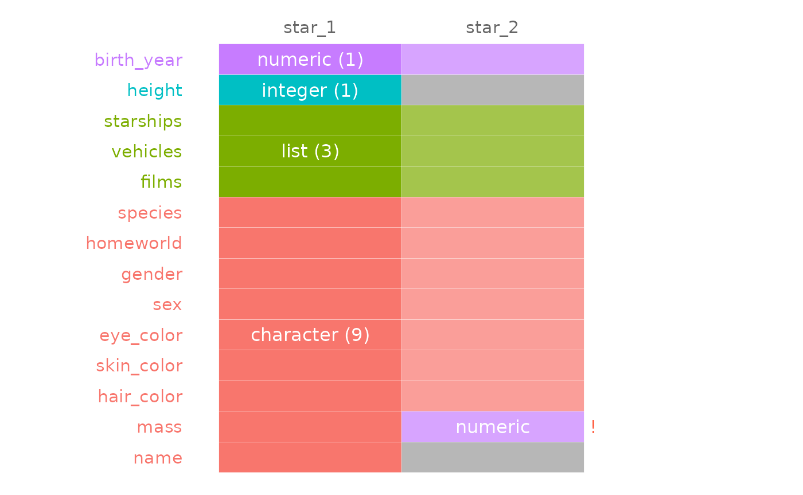

# Exploring dataframe column types

## Illustrative data: `starwars`

The examples below make use of the `starwars` from the `dplyr` package.

``` r

library(dplyr)
data(starwars, package = "dplyr")

# print the first few rows
head(starwars)
```

    ## # A tibble: 6 × 14
    ##   name      height  mass hair_color skin_color eye_color birth_year sex   gender
    ##   <chr>      <int> <dbl> <chr>      <chr>      <chr>          <dbl> <chr> <chr> 
    ## 1 Luke Sky…    172    77 blond      fair       blue            19   male  mascu…
    ## 2 C-3PO        167    75 NA         gold       yellow         112   none  mascu…
    ## 3 R2-D2         96    32 NA         white, bl… red             33   none  mascu…
    ## 4 Darth Va…    202   136 none       white      yellow          41.9 male  mascu…
    ## 5 Leia Org…    150    49 brown      light      brown           19   fema… femin…
    ## 6 Owen Lars    178   120 brown, gr… light      blue            52   male  mascu…
    ## # ℹ 5 more variables: homeworld <chr>, species <chr>, films <list>,
    ## #   vehicles <list>, starships <list>

## `inspect_types()` for a single dataframe

To explore the column types in a data frame, use the function
[`inspect_types()`](https://alastairrushworth.github.io/inspectdf/reference/inspect_types.md).
The command returns a `tibble` summarising the counts and percentages of
columns with particular types.

``` r

library(inspectdf)

# return tibble showing columns types
x <- inspect_types(starwars)
x
```

    ## # A tibble: 4 × 4
    ##   type        cnt  pcnt col_name    
    ##   <chr>     <int> <dbl> <named list>
    ## 1 character     8 57.1  <chr [8]>   
    ## 2 list          3 21.4  <chr [3]>   
    ## 3 numeric       2 14.3  <chr [2]>   
    ## 4 integer       1  7.14 <chr [1]>

The names of columns with specific type can be accessed in the list
columns `col_name`, for example the list columns are found using

``` r

x$col_name$list
```

    ##          12          13          14 
    ##     "films"  "vehicles" "starships"

A radial visualisation of all columns and types is returned by the
[`show_plot()`](https://alastairrushworth.github.io/inspectdf/reference/show_plot.md)
command:

``` r

# radial visualisation of column types
x %>% show_plot()
```



## `inspect_types()` for comparing two data frames

To illustrate the comparison of two data frames, we create two new data
frames by randomly sampling the rows of `starwars`, dropping some of the
columns and recoding the colums `mass` to character. The results are
assigned to the objects `star_1` and `star_2`:

``` r

# sample 50 rows from `starwars`
star_1 <- starwars %>% sample_n(50)
# recode the mass column to character
star_1$mass <- as.character(star_1$mass)
# sample 50 rows from `starwars` and drop the first two columns
star_2 <- starwars %>% sample_n(50) %>% select(-1, -2)
```

When a second dataframe is provided,
[`inspect_types()`](https://alastairrushworth.github.io/inspectdf/reference/inspect_types.md)
returns a tibble that compares the column names and types found in each
of the input data frames. The columns `cnt_1` and `cnt_2` contain the
total number of columns with each type found in the first and second
inputs, respectively:

``` r

# compare the column types for star_1 and star_2
x <- inspect_types(star_1, star_2)
x
```

    ## # A tibble: 4 × 6
    ##   type      equal cnt_1 cnt_2 columns           issues   
    ##   <chr>     <chr> <int> <int> <named list>      <list>   
    ## 1 character ✘         9     7 <tibble [16 × 2]> <chr [2]>
    ## 2 list      ✔         3     3 <tibble [6 × 2]>  <NULL>   
    ## 3 integer   ✘         1     0 <tibble [1 × 2]>  <chr [1]>
    ## 4 numeric   ✘         1     2 <tibble [3 × 2]>  <chr [1]>

`columns` is a named list column containing a list of tibbles. Each
tibble records the names of columns with each type. As an example, all
numeric column names is accessed using:

``` r

# tibble of numeric columns in star_1 or star_2
x$columns$numeric
```

    ## # A tibble: 3 × 2
    ##   col_name   data_arg
    ##   <chr>      <chr>   
    ## 1 birth_year star_1  
    ## 2 mass       star_2  
    ## 3 birth_year star_2

The `issues` column contains a list of character vectors describing
specific points of type or columns mismatch between the two data frame
inputs. The simplest way to view all of the issues is to use the
[`unnest()`](https://tidyr.tidyverse.org/reference/unnest.html) function
from the `tidyr` package:

``` r

library(tidyr)
# unnest the issue columns so we can see where the differences are between star_1 and star_2
x %>% select(type, issues) %>% unnest(issues)
```

    ## # A tibble: 4 × 2
    ##   type      issues                                             
    ##   <chr>     <chr>                                              
    ## 1 character star_1::mass ~ character <!> star_2::mass ~ numeric
    ## 2 character star_1::name ~ character  missing from star_2      
    ## 3 integer   star_1::height ~ integer  missing from star_2      
    ## 4 numeric   star_1::mass ~ character <!> star_2::mass ~ numeric

Finally, we can produce a simple visualisation showing the differences
between `star_1` and `star_2` using
[`show_plot()`](https://alastairrushworth.github.io/inspectdf/reference/show_plot.md):

``` r

# print visualisation of column type comparison
inspect_types(star_1, star_2) %>% show_plot()
```


